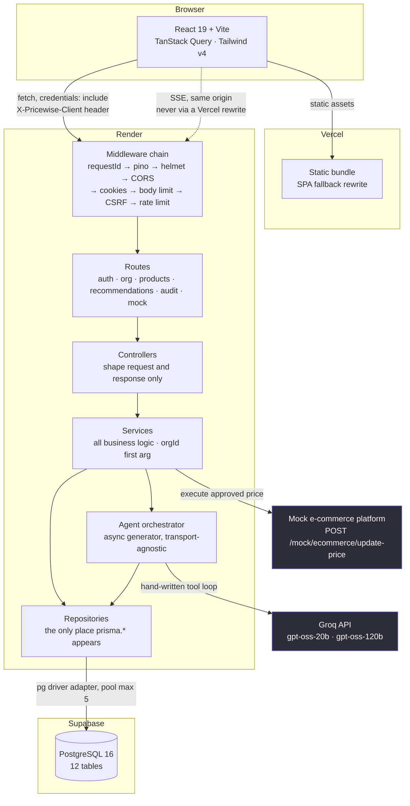
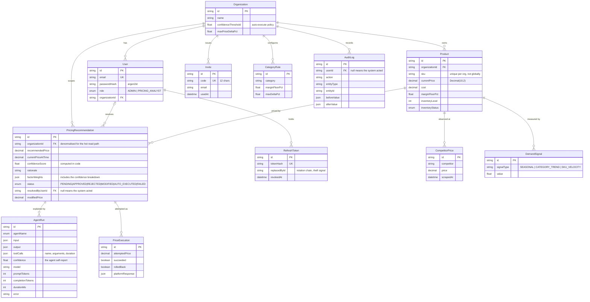
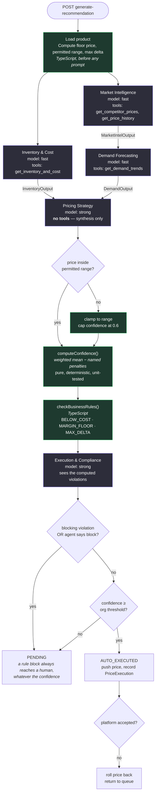
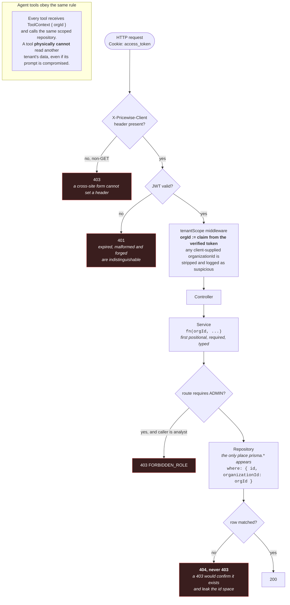
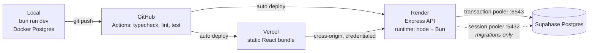

# ARCHITECTURE

Pricewise is a multi-tenant web application in which a five-agent AI system
produces pricing recommendations with confidence scores, and a human approves,
rejects or overrides them before anything reaches a storefront.

Diagrams are Mermaid so they render on GitHub, diff in review, and cannot drift
out of sync with the repository the way an exported image does.

---

## 1. System architecture



**Boundary rules, enforced rather than documented.** The dependency arrows run
one way: `route → controller → service → repository`. Controllers hold no
business `if` statements and never import Prisma. Services take plain arguments
and return plain data, so they are unit-testable without HTTP. An ESLint
`no-restricted-imports` rule fails the build if a Prisma import appears outside
`repositories/`, and a `no-restricted-properties` rule does the same for
`process.env` outside `lib/env.ts`.

The orchestrator is an async generator that yields events and knows nothing
about HTTP. The SSE controller consumes it today; a queue worker could consume
the same generator without touching the pipeline.

---

## 2. Data flow: one recommendation, end to end

```mermaid
sequenceDiagram
    participant U as Analyst
    participant F as Frontend
    participant M as Middleware
    participant O as Orchestrator
    participant T as Tools
    participant G as Groq
    participant D as Postgres

    U->>F: Generate recommendation
    F->>M: POST /products/:id/generate-recommendation
    Note over M: verify JWT → resolve orgId<br/>strip any client-supplied organizationId<br/>require X-Pricewise-Client
    M->>O: run(orgId, productId)
    O->>D: load product, compute floor price and permitted range
    Note over O: arithmetic in TypeScript, before any prompt

    par Wave 1, concurrent
        O->>G: Market Intelligence + tools
        G-->>O: tool_calls
        O->>T: get_competitor_prices / get_price_history
        T->>D: scoped by orgId
        T-->>G: results as data
        G-->>O: MarketIntelOutput (Zod-validated)
    and
        O->>G: Inventory & Cost + tool
        G-->>O: InventoryOutput
    end
    O-->>F: SSE agent_completed ×2

    O->>G: Demand Forecasting
    G-->>O: DemandOutput
    O-->>F: SSE agent_completed

    O->>G: Pricing Strategy (no tools, synthesis only)
    G-->>O: price + rationale + factor weights
    Note over O: clamp to permitted range<br/>cap confidence if the clamp fired

    Note over O: computeConfidence() in code<br/>weighted mean − named penalties

    O->>O: checkBusinessRules() in code
    O->>G: Execution & Compliance (sees violations)
    G-->>O: allow / block / adjust
    Note over O: rule engine wins;<br/>the agent may block, never unblock

    alt blocked by a rule
        O->>D: status PENDING, always to a human
    else confidence ≥ org threshold
        O->>D: status AUTO_EXECUTED
        O->>D: update price + PriceExecution row
    else below threshold
        O->>D: status PENDING
    end
    O->>D: AgentRun ×5 + AuditLog
    O-->>F: SSE recommendation_ready
```

**Failure paths.** Tools return `{ available: false, reason }` rather than
throwing, and a failed tool is handed back to the model as data so it can reason
about the gap. A failed agent degrades the run with a named confidence penalty.
Only a missing cost floor is a hard stop, because a price cannot be produced
without knowing the unit cost. A failed platform push rolls the price back and
returns the recommendation to the queue.

---

## 3. Database schema



**Schema decisions worth defending.**

- **Money is `Decimal(10,2)`, never `Float`.** Converted to `number` only at the
  API boundary. Binary floating point cannot represent `0.01` exactly, and a
  rounding error in a pricing product is not an acceptable class of bug.
- **`organizationId` is denormalised onto `PricingRecommendation`.** The
  approval queue, "every pending recommendation for my org, newest first", is
  the hottest read path. The composite index `[organizationId, status,
  createdAt]` answers it without a join.
- **SKU uniqueness is `@@unique([organizationId, sku])`.** Two tenants may
  legitimately sell a SKU with the same code. Global uniqueness would leak the
  existence of other tenants through a constraint violation.
- **`AgentRun.input/output/toolCalls` are `Json`, not typed columns.** Output
  shapes differ per agent and change with every prompt revision. Json keeps the
  explainability trail complete without a migration per prompt change.
- **A null `userId` on `AuditLog` means the system acted.** That is precisely
  how an auto-executed price change is distinguished from a human approval.

---

## 4. AI orchestration



Green is code. Purple is the model. **The model supplies judgement; code
supplies arithmetic.** The LLM never computes the floor price, the percentage
delta, the margin, the final confidence, or whether a rule is violated.

**The tool loop.** Hand-written against the raw Groq SDK, roughly eighty lines:
send messages, check for `tool_calls`, execute them in parallel, push results
back as `role: "tool"`, repeat until the model returns content, then parse
against a Zod schema with exactly one repair retry that shows the model its own
validation error. No LangChain, no Vercel AI SDK. The model chooses which tools
to call and with what arguments; nothing is pre-fetched into the prompt.

**Scope is structural, not instructed.** No agent's output schema contains a
field outside its own responsibility, and no agent holds a tool outside its own
job. Market Intelligence has no inventory tool and no price field, so it cannot
express an out-of-scope opinion even if its prompt were ignored.

---

## 5. Multi-tenant isolation



**Four independent layers.** A leak requires all four to fail at once:

1. **Type system.** `orgId` is the first positional parameter, required and
   typed. Forgetting it is a compile error, not a runtime leak.
2. **Middleware.** `orgId` originates only from the verified JWT. There is no
   code path where user input reaches a tenant filter.
3. **Lint rule.** Prisma may only be imported inside `repositories/`, so "every
   query is tenant-scoped" is mechanically checkable rather than a claim. CI
   fails if that stops being true.
4. **Database.** Composite indexes are org-scoped and SKU uniqueness is
   per-tenant.

**RBAC.** Two roles. Client-side role checks are UX only; the API enforces
independently, and the settings route is guarded in both places so a typed URL
lands on a forbidden page rather than a broken screen.

| Capability | ADMIN | PRICING_ANALYST |
|---|:---:|:---:|
| View catalog, queue, audit trail | yes | yes |
| Generate a recommendation | yes | yes |
| Approve, reject, modify | yes | yes |
| Create, edit, delete products | yes | no |
| Change the confidence threshold | yes | no |
| Invite and list members | yes | no |

**Proof, run against the live API:**

```
Meridian admin requests a Northwind product   →  404  "Product not found"
Analyst PATCH /org/settings                   →  403  FORBIDDEN_ROLE
Analyst GET  /org/members                     →  403
```

---

## 6. API design

29 operations across 24 paths. Envelope is uniform: `{ success: true, data, pagination? }` or
`{ success: false, error: { code, message, details? } }`. No endpoint returns a
bare array or string. Full contract in [`docs/openapi.yaml`](docs/openapi.yaml).

| Method | Path | Auth | Role | Notes |
|---|---|:---:|:---:|---|
| POST | `/auth/signup` | — | — | Creates an organization and its first admin |
| POST | `/auth/signup/invite` | — | — | Joins an existing org with a 12-char code |
| POST | `/auth/login` | — | — | Rate limited 10 failed attempts / 15 min |
| POST | `/auth/refresh` | cookie | — | Rotates; reuse revokes the chain |
| POST | `/auth/logout` | cookie | — | Clears both cookies |
| GET | `/auth/me` | yes | any | Session, user and organization |
| GET | `/org/settings` | yes | any | Analyst UI shows the threshold |
| PATCH | `/org/settings` | yes | ADMIN | Threshold and max delta |
| GET | `/org/members` | yes | ADMIN | |
| GET | `/org/invites` | yes | ADMIN | |
| POST | `/org/invites` | yes | ADMIN | |
| DELETE | `/org/invites/:inviteId` | yes | ADMIN | |
| GET | `/products` | yes | any | Filter, sort, search, offset paginated |
| GET | `/products/categories` | yes | any | |
| GET | `/products/:productId` | yes | any | 404 cross-tenant |
| POST | `/products` | yes | ADMIN | |
| PATCH | `/products/:productId` | yes | ADMIN | SKU is not patchable |
| DELETE | `/products/:productId` | yes | ADMIN | 204, no envelope |
| POST | `/products/:productId/simulate-market-event` | yes | any | Demo affordance |
| POST | `/products/:productId/generate-recommendation` | yes | any | **SSE stream** |
| GET | `/recommendations` | yes | any | Cursor paginated |
| GET | `/recommendations/:id` | yes | any | Agent runs, tool calls, breakdown |
| POST | `/recommendations/:id/approve` | yes | any | Conditional claim, 409 on race |
| POST | `/recommendations/:id/reject` | yes | any | Reason, min 10 chars |
| POST | `/recommendations/:id/modify` | yes | any | 422 if it breaks a margin rule |
| GET | `/audit-logs` | yes | any | Cursor paginated, filterable |
| GET | `/audit-logs/actions` | yes | any | Distinct actions, for the filter |
| POST | `/mock/ecommerce/update-price` | — | — | Simulated external platform |
| GET | `/healthz` | — | — | Not enveloped; database and Groq checks |

**Error codes.** `VALIDATION_ERROR` (422, carries `fieldErrors` ready to map
back onto a form), `UNAUTHENTICATED` (401), `FORBIDDEN_ROLE` (403),
`NOT_FOUND` (404, also returned for cross-tenant), `CONFLICT` (409, a lost race
or a duplicate SKU), `RATE_LIMITED` (429), `AGENT_TIMEOUT` (504),
`INTERNAL` (500, returns a correlation id and never a stack trace).

**SSE contract.** `agent_started`, `agent_completed`, `agent_skipped`,
`recommendation_ready`, `recommendation_failed`. Sent with `no-transform` and
`X-Accel-Buffering: no`, because a proxy that buffers this stream turns five
visible steps into one long pause. The client reads it with `fetch` rather than
`EventSource`, which can neither POST nor set the CSRF header.

---

## Deployment



Two deployment decisions that are easy to get wrong:

**The frontend calls the Render origin directly for everything, including SSE.**
Routing JSON through a Vercel rewrite while SSE went direct would split the
cookie jar: login would set a first-party cookie on `vercel.app` and the SSE
POST to `onrender.com` would carry none. Going fully direct costs cross-site
cookies, which is a knowable, testable problem, rather than a buffered stream,
which fails silently in the middle of a demo.

**Migrations run over the session pooler, not the transaction pooler.**
`prisma migrate deploy` takes a Postgres advisory lock and issues DDL, and
neither survives pgbouncer transaction pooling. Supabase's "Direct connection"
host is IPv6-only and unreachable from Render, so `DIRECT_URL` is the session
pooler despite the name.
