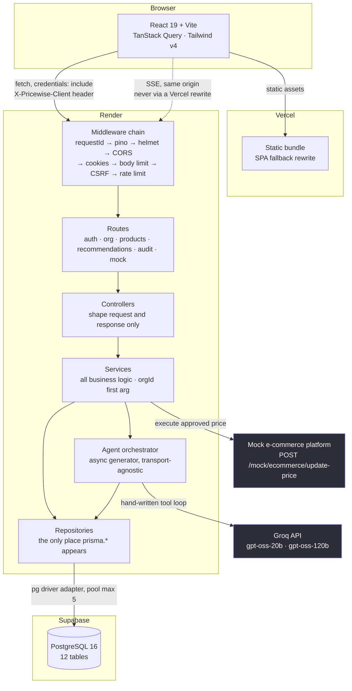

# Pricewise

A multi-tenant pricing tool where five AI agents produce a price recommendation
with a confidence score, and a human approves, rejects or overrides it before
anything reaches the storefront.

Built for the Klypup Applied AI Intern assessment, **Option B: Dynamic Pricing
Intelligence**.

| | |
|---|---|
| **Live** | _not yet deployed_ |
| **Architecture** | [ARCHITECTURE.md](ARCHITECTURE.md) |
| **Decisions** | [DECISIONS.md](DECISIONS.md) |
| **API contract** | [docs/openapi.yaml](docs/openapi.yaml) |

---

## Why Option B

Option A is a research assistant: type a question, get prose back. The
interesting engineering is retrieval.

Option B has something Option A does not: **a decision with consequences**. A
price change touches a storefront, which forces questions a chatbot never has
to answer. What happens when the model is confident and wrong? Who is
accountable when nobody clicked approve? What stops an LLM arithmetic slip from
selling below cost?

Those questions produced the parts of this codebase worth reading: a rule
engine that can veto the model, a confidence score the model is not allowed to
compute, and an audit trail that distinguishes a human approval from a machine
one.

---

## Running it

**Requirements:** [Docker](https://docs.docker.com/get-docker/) and
[Bun](https://bun.sh) 1.3+, plus a free
[Groq API key](https://console.groq.com/keys). Docker supplies PostgreSQL; if
you would rather use your own, see the second path below.

### Everything in one command

```bash
git clone https://github.com/AbhigyanRaj/price-wise.git
cd price-wise
cp apps/backend/.env.example apps/backend/.env
# Add your GROQ_API_KEY to that file. The other defaults work as they are.

docker compose up --build
```

That brings up Postgres, the API and the web app, runs the migrations and seeds
the database. Open **http://localhost:5173**.

### Or run it directly with Bun

Faster to iterate on, and what the dev scripts are built for.

```bash
git clone https://github.com/AbhigyanRaj/price-wise.git
cd price-wise
bun install

cp apps/backend/.env.example apps/backend/.env
# Add your GROQ_API_KEY. To generate the two JWT secrets:
#   openssl rand -base64 48        (run it twice, they must differ)

bun run db:up          # Postgres on 5432, Adminer on 8080
bun run db:generate    # Prisma 7 emits the client into the source tree, and it
                       # is gitignored, so a fresh clone must generate it first
bun run db:migrate
bun run db:seed
bun run dev            # API on :4000, app on :5173
```

Open **http://localhost:5173**.

**Using your own Postgres instead of Docker?** Point `DATABASE_URL` in
`apps/backend/.env` at it, skip `db:up`, and create a second database called
`pricewise_test` if you intend to run the backend tests.

**Port already in use?** `POSTGRES_PORT=5433 ADMINER_PORT=8081 bun run db:up`,
and change the port in `DATABASE_URL` to match.

### Sign in

Seeded accounts, all with the password `Pricewise2026!`. These are throwaway
credentials for a demo database, not secrets.

| Email | Role | Organization |
|---|---|---|
| `admin@suvidha.test` | Admin | Suvidha Retail |
| `analyst@suvidha.test` | Pricing Analyst | Suvidha Retail |
| `admin@bazaarkart.test` | Admin | Bazaar Kart |
| `analyst@bazaarkart.test` | Pricing Analyst | Bazaar Kart |

**The two organizations are the multi-tenancy demo.** They share a database and
a schema, have zero overlapping SKUs, and different auto-execution policies
(0.80 and 0.75). Signing in as each shows a completely different catalogue.

You can also create your own workspace at `/signup`, or join one with an invite
code at `/join`.

---

## What to look at

**Catalog → open a product → Generate recommendation.** Five agents run live
over SSE. The two that run concurrently start on the same millisecond, which is
the architecture visible on screen rather than asserted in a diagram. Takes
about 8 seconds.

**Decisions → open one.** The rationale first, then the confidence broken into
a base score and named deductions, then every agent with the tools it called,
the arguments it chose and the source that answered. Nothing in that view is a
number you have to trust.

**Try to break it.** Modify a recommendation to a price below cost. A human
override is checked against the same margin floor as the AI, and comes back
with the rule that stopped it.

The seed plants five scenarios that each exercise a different branch:

| SKU | What it demonstrates |
|---|---|
| `SR-ELEC-0001` | Aggressive competitor undercut |
| `SR-ELEC-0007` | Margin floor blocks the obvious move |
| `SR-APPA-0003` | Demand surge with low stock |
| `BK-OUTD-0005` | Stale data penalty routes it to a human |
| `BK-BEAU-0009` | Market and demand disagree, disagreement penalty fires |

---

## How it fits together

Rendered inline rather than screenshotted: these diff in review and cannot
drift away from the repository the way an exported image does. Four more, the
data flow, the ER model, tenant isolation and the API surface, are in
[ARCHITECTURE.md](ARCHITECTURE.md).

### System architecture



### The five-agent pipeline

Green is code, purple is the model. **The model supplies judgement; code
supplies arithmetic.**


---

## Stack

| Layer | Choice | Why |
|---|---|---|
| Runtime | Bun | One toolchain for install, run and test |
| Backend | Express 5 | Explicit middleware ordering **is** the security model, and I wanted it reviewable as a list |
| Database | PostgreSQL + Prisma 7 | Money needs `DECIMAL`; tenancy needs foreign keys |
| LLM | Groq, raw SDK | Hand-written tool loop, no LangChain. See below |
| Validation | Zod 4, shared | One schema compiled into both client and server |
| Frontend | React 19 + Vite + Tailwind v4 | Static bundle, deploys anywhere |
| Auth | Custom JWT in httpOnly cookies | Refresh rotation with reuse detection is the part worth understanding |

Full reasoning, including what was rejected, in [DECISIONS.md](DECISIONS.md).

---

## The AI part

Five agents with non-overlapping responsibilities:

```
Market Intelligence  ┐
                     ├─ concurrent ─→ Demand ─→ Strategy ─→ Compliance
Inventory & Cost     ┘                                          │
                                              confidence ≥ threshold?
                                                ├─ yes → execute
                                                └─ no  → human queue
```

Four things that matter more than the agent count:

**A hand-written tool loop, about eighty lines.** No framework. The model
chooses which tools to call and with what arguments; nothing is pre-fetched and
stuffed into a prompt. In one recorded run the model called
`get_competitor_prices` with a 7-day window, read the result, then called it
again with 30 days unprompted.

**Scope is structural, not instructed.** No agent's output schema contains a
field outside its own responsibility, and no agent holds a tool outside its own
job. Market Intelligence has no inventory tool and no price field, so it cannot
express an out-of-scope opinion even if its prompt were ignored.

**The model supplies judgement; code supplies arithmetic.** The LLM never
computes the floor price, the delta, the margin, the final confidence, or
whether a rule is violated. `computeConfidence()` is a pure function: a
weighted mean of agent self-reports minus **named** penalties. Ask a model for
a confidence score twice and you get two numbers; this one is reproducible and
unit-tested.

**The rule engine outranks the model.** The Execution agent sees the computed
violations and may add a block, but it cannot remove one. A high-confidence
recommendation that breaches the margin floor still goes to a human.

---

## Tests

```bash
bun run typecheck && bun run lint
bun run test            # 227 tests: 131 backend, 96 frontend
bun run test:e2e        # 5 Playwright specs, needs the stack running
```

Backend tests need a database: `TEST_DATABASE_URL=... bun run --cwd apps/backend test:setup` first.

The Playwright suite approves real recommendations, so it consumes the pending
queue. Run `bun run --cwd apps/backend db:seed` before it if you want a
repeatable run. It is deliberately not part of `bun run test` for that reason.

**No test makes a network call.** Groq is mocked at the cache boundary, so the
real tool loop runs with zero traffic. A flaky, expensive suite is a suite
nobody trusts.

Coverage worth knowing about: a tenant-isolation suite asserting 404 and never
403; a concurrency test proving two simultaneous approvals resolve to one
winner and one 409; and a contrast test that parses the shipped stylesheet and
checks 21 colour pairs against WCAG AA in **both** themes, which already caught
one failing value in the design handoff.

CI runs typecheck, lint, the full suite against a Postgres service container,
and a production build.

---

---

## Screens

All captured from the running application against seeded data.

### Sign in


Custom JWT auth in an httpOnly cookie. No third-party identity provider, no
hardcoded login. Signup, invite-join and logout all exist behind it.

### Overview


The landing screen answers one question: what needs me. Pending count, recent
decisions and the activity tail, each with its own loading, empty and error
state.

### Product catalogue


Every SKU with current price, the last competitor check, margin, inventory
status and recommendation state. Filter, sort and search are server side, so
they work across the whole catalogue rather than the loaded page.

### Decision queue


Two panes, because resolving one decision should reveal the next rather than
returning to a list. Sorted by confidence descending: clear the obvious ones
quickly, spend attention on the ambiguous. J and K move, A approves, R rejects.

### Decision detail


Price and confidence first, because that is the decision. Then what changes if
you take it, then what each agent contributed with its factor weight, then the
tool calls underneath. Approve, modify or reject, with the modify path checked
against the same margin floor the AI was.

### Agent pipeline, mid-run


Streamed over SSE as it happens, three of five agents done. Wave 1 runs Market
Intelligence and Inventory & Cost concurrently; wave 2 is sequential because
each step needs the one before it.

### Agent pipeline, complete


Per-agent confidence and duration, then the threshold branch: this run landed
below the configured confidence threshold, so it was routed to a human instead
of executing. Above the threshold it would have auto-executed and said so.

### Audit trail


Append only. Every state change with its actor, before and after values, and
timestamp. A null actor is the system, which is how an auto-executed price
change is distinguished from a human approval. Filterable and searchable.

### Settings


Admin only, and enforced by the API independently of this screen. The
confidence threshold shows its consequence against the last 50 runs rather than
asking an admin to guess what 0.80 means.

---
## Known limitations

Stated rather than hidden.

- **Not deployed yet.** Manifests for Render and Vercel are in the repo and the
  code is ready for a split-origin deploy; the accounts are not linked.
- **Competitor and demand data are synthetic**, generated by
  `apps/backend/src/scripts/`. The tool interface is the real shape, so
  swapping in a live feed would not change the agents.
- **The e-commerce platform is a mock**, exposed as a real HTTP route so it is
  visibly an external system that can fail, with configurable failure and
  rollback.
- **Confidence is corrected, not calibrated.** The threshold was moved from
  0.85 to 0.80 on 13 measured runs because the original figure auto-executed
  23% against a 40-60% target. That fixes an obviously mis-set constant; it does
  not establish that the score predicts whether a human agrees. That needs human
  decisions to compare against. See DECISIONS.md §6.
- **`--t5` in the design palette is below WCAG AA** at 2.68:1, and the handoff
  uses it for the keyboard-hint strip. Recorded as a bounded exemption in the
  contrast test rather than passed over silently.
- **The Playwright suite needs a running stack.** It drives a real browser
  against a seeded database, so `docker compose up` (or the Bun path plus
  `db:seed`) has to be up first. It is not part of `bun run test` for that
  reason.
- **Mobile is supported but not the target.** Every route was checked for
  horizontal overflow at 375, 640, 768, 1024 and 1280, and the shell reflows to
  a bottom tab bar below 768. It is a dense data tool built for a desktop
  analyst; the catalogue drops columns on a phone rather than pretending a
  nine-column table fits.
- **Cut deliberately:** Postgres RLS as a defence-in-depth backstop, bulk
  approve, and URL-synced filter state.

---

## Layout

```
apps/backend     Express API, Prisma, the five agents
apps/frontend    React app
packages/shared  Zod schemas imported by both, so rules cannot drift
docs/            PRD, implementation plan, API contract, diagrams, spike notes
```

The backend follows `route → controller → service → repository`, one direction
only. Prisma may only be imported inside `repositories/`, and `process.env` may
only be read in `lib/env.ts`. **Both are enforced by lint rules rather than by
review**, which is what makes "every query is tenant-scoped" a checkable claim
rather than an assertion. It caught a real violation during the build.
