# Pricewise

**The problem.** A mid-size retailer sells 500+ SKUs and reprices them by hand,
once a week, in a spreadsheet. A competitor drops a price on Tuesday and
nothing happens until the following Monday. That lag leaks an estimated 8 to
12% of revenue, slow-moving stock gets marked down instead of repriced, demand
spikes pass unexploited, and a team of six analysts spends most of its week
gathering data rather than deciding anything.

**What this does.** Five AI agents watch the catalogue and propose a price for
any product, each agent owning one question: where the market is, what the
product costs us, where demand is going, what price follows from all three, and
whether that price is allowed. Each recommendation carries a confidence score
and a written rationale.

**Who decides.** A human. Nothing reaches the storefront without approval,
unless it clears a confidence threshold the organization sets for itself. An
analyst can approve, reject with a reason, or override the price, and every
outcome is recorded against a person or against the system.

Built for the Klypup Applied AI Intern assessment, **Option B: Dynamic Pricing
Intelligence**.

| | |
|---|---|
| **Live** | _not yet deployed_ |
| **Architecture, six diagrams** | [ARCHITECTURE.md](ARCHITECTURE.md) |
| **Design canvas** | [docs/Pricewise_HLD.excalidraw](docs/Pricewise_HLD.excalidraw) · [PNG](docs/Pricewise_HLD.png) |
| **Decisions and trade-offs** | [DECISIONS.md](DECISIONS.md) |
| **API contract, 34 operations** | [docs/openapi.yaml](docs/openapi.yaml) · [JSON](docs/openapi.json) |
| **Environment variables** | [apps/backend/.env.example](apps/backend/.env.example) |

---

## Why Option B

Option A is a research assistant: type a question, get prose back. The
interesting engineering is retrieval.

Option B has something Option A does not: **a decision with consequences**. A
price change touches a storefront, which forces questions a chatbot never has
to answer. What happens when the model is confident and wrong? Who is
accountable when nobody clicked approve? What stops an LLM arithmetic slip from
selling below cost?

Those questions produced the parts of this codebase worth reading: a rule
engine that can veto the model, a confidence score the model is not allowed to
compute, and an audit trail that distinguishes a human approval from a machine
one.

---

## Running it

**For the one-command path:** [Docker](https://docs.docker.com/get-docker/)
and a free [Groq API key](https://console.groq.com/keys). That is all.

**For the Bun path:** additionally [Bun](https://bun.sh) 1.3+. Docker still
supplies PostgreSQL unless you point `DATABASE_URL` at your own.

### Everything in one command

```bash
git clone https://github.com/AbhigyanRaj/price-wise.git
cd price-wise
cp apps/backend/.env.example apps/backend/.env
# Add your GROQ_API_KEY to that file. The other defaults work as they are.

docker compose up --build
```

That brings up Postgres, the API and the web app, runs the migrations and seeds
the database. Open **http://localhost:5173**.

### Or run it directly with Bun

Faster to iterate on, and what the dev scripts are built for.

```bash
git clone https://github.com/AbhigyanRaj/price-wise.git
cd price-wise
bun install

cp apps/backend/.env.example apps/backend/.env
# Add your GROQ_API_KEY. To generate the two JWT secrets:
#   openssl rand -base64 48        (run it twice, they must differ)

bun run db:up          # Postgres on 5432, Adminer on 8080
bun run db:generate    # Prisma 7 emits the client into the source tree, and it
                       # is gitignored, so a fresh clone must generate it first
bun run db:migrate
bun run db:seed
bun run dev            # API on :4000, app on :5173
```

Open **http://localhost:5173**.

**Using your own Postgres instead of Docker?** Point `DATABASE_URL` in
`apps/backend/.env` at it, skip `db:up`, and create a second database called
`pricewise_test` if you intend to run the backend tests.

**Port already in use?** `POSTGRES_PORT=5433 ADMINER_PORT=8081 bun run db:up`,
and change the port in `DATABASE_URL` to match.

### Sign in

Seeded accounts, all with the password `Pricewise2026!`.

**Why these are in a public repository.** This is an assessment submission, and
an evaluator has to be able to sign in without waiting on an email. The four
accounts below do not exist anywhere until `db:seed` creates them, they live in
a database that is dropped and rebuilt every time that command runs, and they
grant access to nothing but a catalogue of invented products. There is no real
user, no real store and no real money behind any of them. The password is a
seed constant in `apps/backend/src/scripts/catalog.ts`, not a secret, and the
only genuine secrets this project has, the Groq key and the two JWT signing
keys, are in `.env` and gitignored.

| Email | Role | Organization |
|---|---|---|
| `admin@suvidha.test` | Admin | Suvidha Retail |
| `analyst@suvidha.test` | Pricing Analyst | Suvidha Retail |
| `admin@bazaarkart.test` | Admin | Bazaar Kart |
| `analyst@bazaarkart.test` | Pricing Analyst | Bazaar Kart |

**The two organizations are the multi-tenancy demo.** They share a database and
a schema, have zero overlapping SKUs, and different auto-execution policies
(0.80 and 0.75). Signing in as each shows a completely different catalogue.

You can also create your own workspace at `/signup`, or join one with an invite
code at `/join`.

---

## Five minutes, in order

Sign in as `admin@suvidha.test`.

**1 · Overview.** What needs a decision today, and what the queue is worth in
money rather than in row count.

**2 · Products → open any product → Generate recommendation.** The main event.
Five agents run live over SSE, about 8 to 12 seconds. The two in wave 1 start
on the same millisecond, so the concurrency is visible on screen rather than
asserted in a diagram. It ends by either auto-executing or saying it is waiting
on you, depending on the confidence it reached.

**3 · Decisions → open one.** Price and confidence first, because that is the
decision. Then what changes if you take it. Then what each agent contributed,
with the tools it chose to call, the arguments it chose, and what answered.
Nothing in that view is a number you have to take on trust.

**4 · Approve it.** `A` approves, `R` rejects, `J` and `K` move. An undo
appears for a few seconds, and the queue advances to the next decision rather
than emptying.

**5 · Try to break it.** Modify a recommendation to a price below cost. A human
override is checked against the same margin floor the AI was, and comes back
naming the rule that stopped it.

**6 · Activity.** Every change, who made it, before and after. "Pricewise" in
the actor column means it executed without a human.

**7 · Settings.** Drag the confidence threshold and watch the histogram of the
last 50 runs: it shows how many decisions you would be handing to the machine
before you commit to it.

**8 · Sign out, sign in as `admin@bazaarkart.test`.** A different company.
Different catalogue, different threshold, no overlap. Then try
`analyst@suvidha.test`: Settings disappears, and typing `/settings` into the
address bar is refused by the API, not just hidden by the UI.

The seed plants five scenarios that each exercise a different branch:

| SKU | Org | What it demonstrates |
|---|---|---|
| `SR-ELEC-0007` | Suvidha | Aggressive competitor undercut. Strong decrease, high confidence, likely auto-executes |
| `SR-HOME-0012` | Suvidha | Margin floor blocks the obvious move. Compliance overrules the strategist |
| `SR-APPA-0003` | Suvidha | Demand surge with low stock. Price goes **up**, not down |
| `BK-OUTD-0005` | Bazaar Kart | Stale competitor data. The confidence penalty routes it to a human |
| `BK-BEAU-0009` | Bazaar Kart | Market says falling, demand says accelerating. Disagreement penalty fires |

The `SR-` SKUs belong to Suvidha Retail and the `BK-` ones to Bazaar Kart, so
sign in as the matching org first. These are generated by
`apps/backend/src/scripts/catalog.ts` (`PLANTED_SCENARIOS`), not hand-edited
rows, so they survive a reseed.

---

## How it fits together

Rendered inline rather than screenshotted: these diff in review and cannot
drift away from the repository the way an exported image does. Four more, the
data flow, the ER model, tenant isolation and the API surface, are in
[ARCHITECTURE.md](ARCHITECTURE.md).

### System architecture

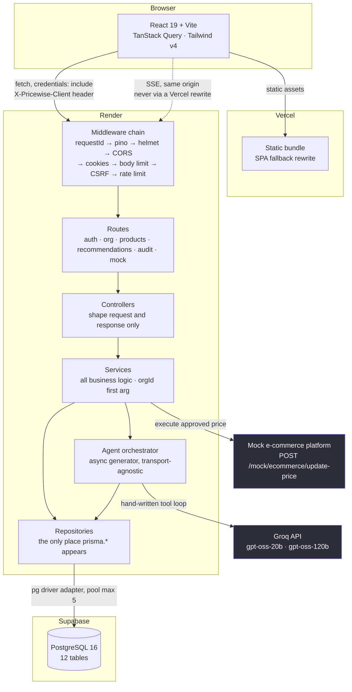

### The five-agent pipeline

Green is code, purple is the model. **The model supplies judgement; code
supplies arithmetic.**

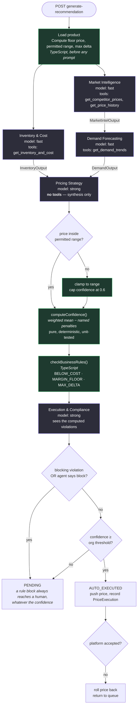

---

## Stack

| Layer | Choice | Why |
|---|---|---|
| Runtime | Bun | One toolchain for install, run and test |
| Backend | Express 5 | Explicit middleware ordering **is** the security model, and I wanted it reviewable as a list |
| Database | PostgreSQL + Prisma 7 | Money needs `DECIMAL`; tenancy needs foreign keys |
| LLM | Groq, raw SDK | Hand-written tool loop, no LangChain. See below |
| Validation | Zod 4, shared | One schema compiled into both client and server |
| Frontend | React 19 + Vite + Tailwind v4 | Static bundle, deploys anywhere |
| Auth | Custom JWT in httpOnly cookies | Refresh rotation with reuse detection is the part worth understanding |

Full reasoning, including what was rejected, in [DECISIONS.md](DECISIONS.md).

---

## The AI part

Five agents with non-overlapping responsibilities:

```
Market Intelligence  ┐
                     ├─ concurrent ─→ Demand ─→ Strategy ─→ Compliance
Inventory & Cost     ┘                                          │
                                              confidence ≥ threshold?
                                                ├─ yes → execute
                                                └─ no  → human queue
```

Four things that matter more than the agent count:

**A hand-written tool loop, about eighty lines.** No framework. The model
chooses which tools to call and with what arguments; nothing is pre-fetched and
stuffed into a prompt. In one recorded run the model called
`get_competitor_prices` with a 7-day window, read the result, then called it
again with 30 days unprompted.

**Scope is structural, not instructed.** No agent's output schema contains a
field outside its own responsibility, and no agent holds a tool outside its own
job. Market Intelligence has no inventory tool and no price field, so it cannot
express an out-of-scope opinion even if its prompt were ignored.

**The model supplies judgement; code supplies arithmetic.** The LLM never
computes the floor price, the delta, the margin, the final confidence, or
whether a rule is violated. `computeConfidence()` is a pure function: a
weighted mean of agent self-reports minus **named** penalties. Ask a model for
a confidence score twice and you get two numbers; this one is reproducible and
unit-tested.

**The rule engine outranks the model.** The Execution agent sees the computed
violations and may add a block, but it cannot remove one. A high-confidence
recommendation that breaches the margin floor still goes to a human.

---

## Environment

Two files, both with a committed `.env.example` that lists every key with what
it is for.

| | |
|---|---|
| **Backend** | [`apps/backend/.env.example`](apps/backend/.env.example) → copy to `apps/backend/.env` |
| **Frontend** | [`apps/frontend/.env.example`](apps/frontend/.env.example) → optional, see below |

**The only one you must set** is `GROQ_API_KEY`, free from
[console.groq.com/keys](https://console.groq.com/keys). Every other default in
the backend example works as it stands for local development.

For anything other than localhost you also need real signing keys:

```bash
openssl rand -base64 48   # run twice, JWT_ACCESS_SECRET and JWT_REFRESH_SECRET
```

They must differ. A refresh token that verifies against the access secret is a
refresh token that works as an access token.

**The backend keys worth understanding:**

| Key | Why it exists |
|---|---|
| `DATABASE_URL` | Pooled connection. Supabase's pooler in production. |
| `DIRECT_URL` | Unpooled, used only by `prisma migrate`. Leave unset locally. |
| `COOKIE_SECURE` | One flag drives both `Secure` and `SameSite`. `true` gives `None`+`Secure`, which a cross-site deployment requires; `false` gives `Lax` for local HTTP. Deriving both from one flag makes the invalid combination, `None` without `Secure`, unrepresentable. |
| `CORS_ORIGIN` | The frontend's exact origin. No wildcards: credentialed requests forbid them. |
| `GROQ_MODEL_FAST` / `_STRONG` | Two tiers. The three analysis agents use the fast one, synthesis and compliance use the strong one. |
| `MOCK_PLATFORM_FAILURE_RATE` | Probability a simulated price push fails. `0` for deterministic runs, `1` to demonstrate rollback. |

**The frontend has one variable**, `VITE_API_URL`, and it is deliberately unset
for both local development and Docker. It defaults to the relative path `/api`,
which Vite proxies in dev and nginx proxies in Docker. Keeping the API
same-origin means the auth cookie stays `SameSite=Lax` and there is no CORS
preflight at all. Set it only for a split deployment, and then
`COOKIE_SECURE=true` on the backend is mandatory rather than optional.

Only `lib/env.ts` reads `process.env`. It parses everything with Zod at boot
and crashes on anything missing or malformed, so a misconfigured deploy fails
immediately instead of 500ing on a reviewer's first click.

---

## Tests

```bash
bun run typecheck && bun run lint
bun run test            # 230 tests: 132 backend, 98 frontend
bun run test:e2e        # 5 end-to-end tests in 1 spec, needs the stack running
```

Backend tests need a database: `TEST_DATABASE_URL=... bun run --cwd apps/backend test:setup` first.

The Playwright suite approves real recommendations, so it consumes the pending
queue. Run `bun run --cwd apps/backend db:seed` before it if you want a
repeatable run. It is deliberately not part of `bun run test` for that reason.

**No test makes a network call.** Groq is mocked at the cache boundary, so the
real tool loop runs with zero traffic. A flaky, expensive suite is a suite
nobody trusts.

Coverage worth knowing about: a tenant-isolation suite asserting 404 and never
403; a concurrency test proving two simultaneous approvals resolve to one
winner and one 409; and a contrast test that parses the shipped stylesheet and
checks 21 colour pairs against WCAG AA in **both** themes, which already caught
one failing value in the design handoff.

CI runs typecheck, lint, the full suite against a Postgres service container,
a production build, and a check that the API document still matches the routes.

---

## Deploying

Vercel serves the frontend, Render runs the API, Supabase holds the database.
[`render.yaml`](render.yaml) provisions the API;
[`apps/frontend/vercel.json`](apps/frontend/vercel.json) configures the build.

**The two sides need each other's URL**, so the order matters:

**1 · Supabase.** New project. From Settings → Database copy two connection
strings:

| Variable | Which one | Why |
|---|---|---|
| `DATABASE_URL` | **Transaction pooler**, port 6543 | What the app runs on |
| `DIRECT_URL` | **Session pooler**, port 5432 | Migrations only; the pooler cannot run DDL |

Not the one labelled "Direct connection". On current free projects it is
IPv6-only and Render has no outbound IPv6, so it hangs and then fails.

**2 · Render.** New Blueprint from this repository. It reads `render.yaml` and
asks for the five secrets marked `sync: false`: the two Supabase URLs, two JWT
secrets (`openssl rand -base64 48`, twice, they must differ), and the Groq key.
Leave `CORS_ORIGIN` as it is for now. Note the service URL it gives you.

**3 · Vercel.** Import the repository, set the root directory to
`apps/frontend`. Add one environment variable:

```
VITE_API_URL = https://your-api.onrender.com     # no trailing slash
```

**This is not optional.** Without it the app calls its own origin, the SPA
rewrite answers every API call with `index.html`, and nothing works. The app
now says so explicitly if it happens rather than showing a generic error, but
it is easier not to hit it.

**4 · Back to Render.** Set `CORS_ORIGIN` to the exact Vercel URL, no trailing
slash and no path. Edit it in `render.yaml` and push rather than in the
dashboard: a Blueprint sync overwrites dashboard edits to literal values.

**5 · Seed the production database.** Migrations run on every deploy but the
seed deliberately does not, because it truncates first and a redeploy
mid-review would wipe the reviewer's session. So run it once, by hand, against
the production database:

```bash
DATABASE_URL="<the Supabase transaction pooler URL>" bun run --cwd apps/backend db:seed
```

Skip this and the deploy succeeds, the health check passes, and the app is
completely empty.

**6 · Check it.**

```bash
curl https://your-api.onrender.com/healthz          # {"status":"ok"}
```

Then sign in on the Vercel URL and generate one recommendation, which exercises
the two things that only break in production: the cross-site auth cookie and
the SSE stream.

### If something is wrong

| Symptom | Cause |
|---|---|
| Login returns 200, every later call 401s | `COOKIE_SECURE` is not `true`, so the cookie is `SameSite=Lax` and never sent cross-site |
| Browser console shows a CORS error | `CORS_ORIGIN` does not exactly match the Vercel origin. Compared with `===`: a trailing slash fails |
| Every call errors mentioning HTML | `VITE_API_URL` is unset or points at the frontend |
| The pipeline shows nothing for ten seconds then everything at once | A proxy is buffering the SSE stream |
| First request after a quiet period takes ~50s | Render's free tier spun the service down. Expected, not a bug, but warn anyone reviewing it |

---

## Beyond the brief

Built because the product needed it, and listed here because none of it is
visible from the screens:

| | Where |
|---|---|
| **Real-time streaming** | SSE, six named events, `apps/backend/src/controllers/stream.controller.ts` |
| **One-command setup** | `docker compose up --build`, four services, migrated and seeded |
| **CI/CD** | [`.github/workflows/ci.yml`](.github/workflows/ci.yml): typecheck, lint, tests, build, contract check |
| **Infrastructure as code** | [`render.yaml`](render.yaml), a Render blueprint with the health gate wired in |
| **Observability** | `/healthz` pings the database, so a bad `DATABASE_URL` fails the deploy rather than shipping a service that 500s. Structured logging via pino, every line carrying a request id. |
| **Caching** | `apps/backend/src/agents/cache.ts` keys on the full prompt, so a changed prompt cannot serve a stale answer. Cuts the free-tier bill and makes repeat demos fast. |
| **Rate limiting** | Two limiters: a broad one per IP, and a brute-force one on the three routes that take a password, keyed on address **and** email so one account's failures cannot lock out another's |
| **Export** | CSV of the decisions queue, RFC 4180 escaped, with a guard against formula injection |
| **Explainability** | Every agent run persists its tool calls, arguments and token counts. The detail view renders them; nothing on it is a number you have to trust. |
| **Accessibility** | A test parses the shipped stylesheet and checks 21 colour pairs against WCAG AA in both themes |

**Not built:** A/B price testing. It is one bonus of eleven and roughly a day
of work, and the day was better spent on the items above. Recorded as a
deliberate cut in [DECISIONS.md](DECISIONS.md).

---

## Screens

All captured from the running application against seeded data.

### Sign in

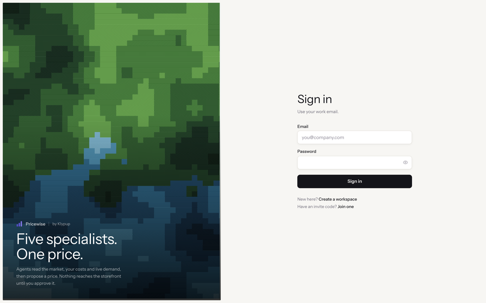

Custom JWT auth in an httpOnly cookie. No third-party identity provider, no
hardcoded login. Signup, invite-join and logout all exist behind it.

### Overview

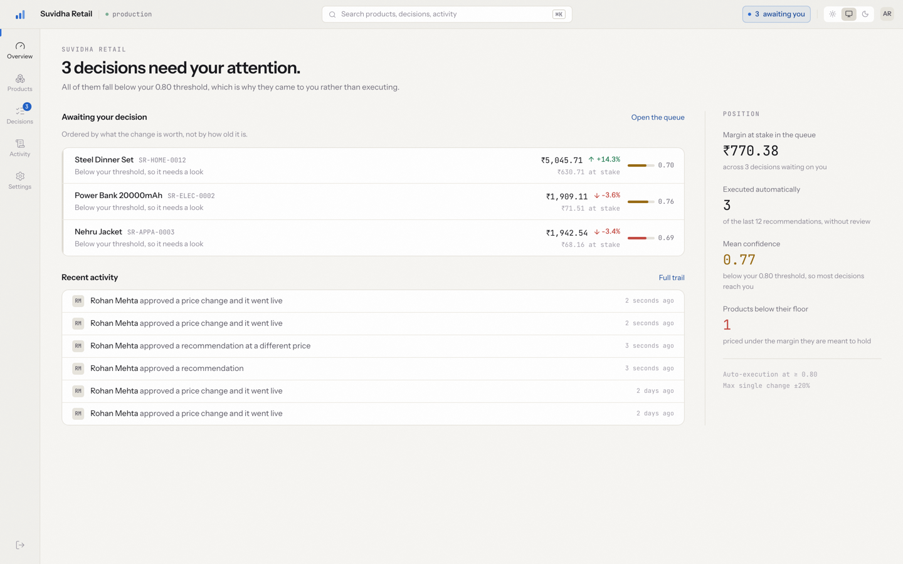

The landing screen answers one question: what needs me. Pending count, recent
decisions and the activity tail, each with its own loading, empty and error
state.

### Product catalogue

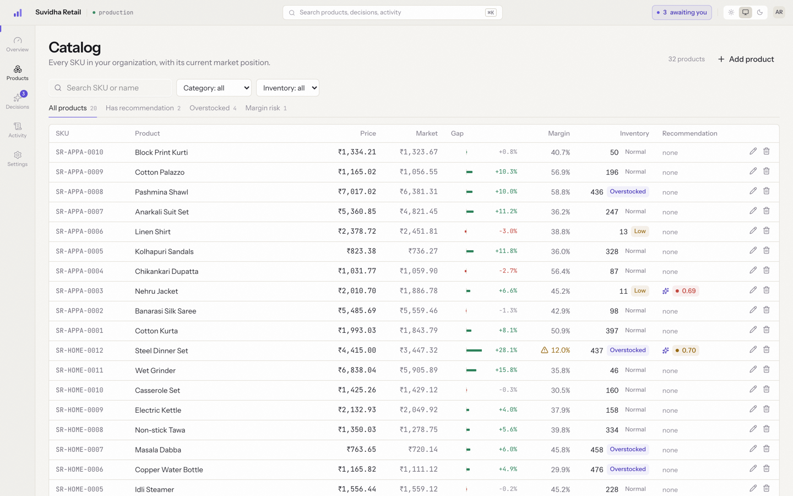

Every SKU with current price, the last competitor check, margin, inventory
status and recommendation state. Filter, sort and search are server side, so
they work across the whole catalogue rather than the loaded page.

### Decision queue

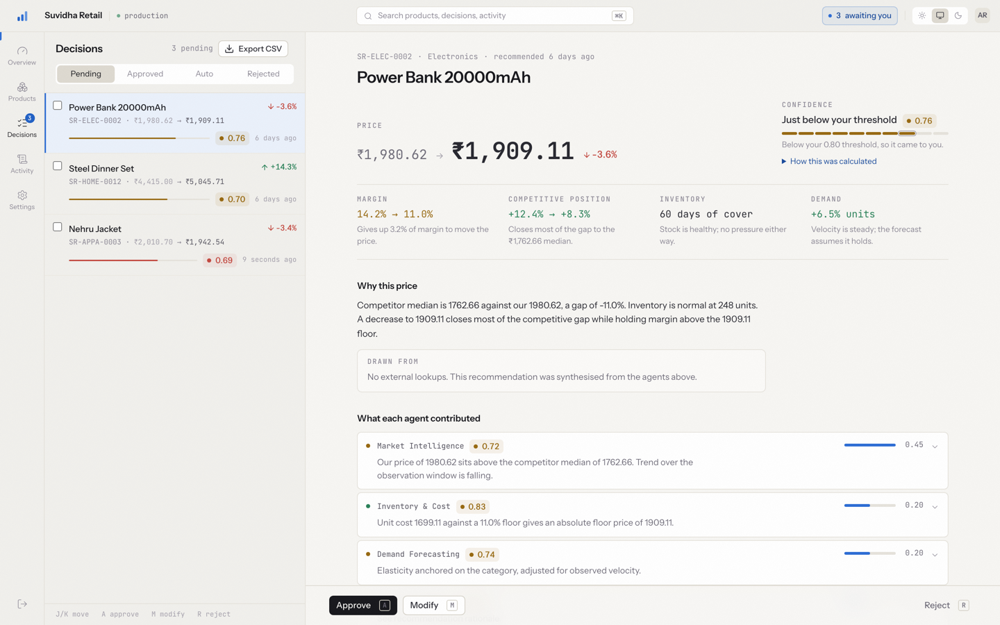

Two panes, because resolving one decision should reveal the next rather than
returning to a list. Sorted by confidence descending: clear the obvious ones
quickly, spend attention on the ambiguous. J and K move, A approves, R rejects.

### Decision detail

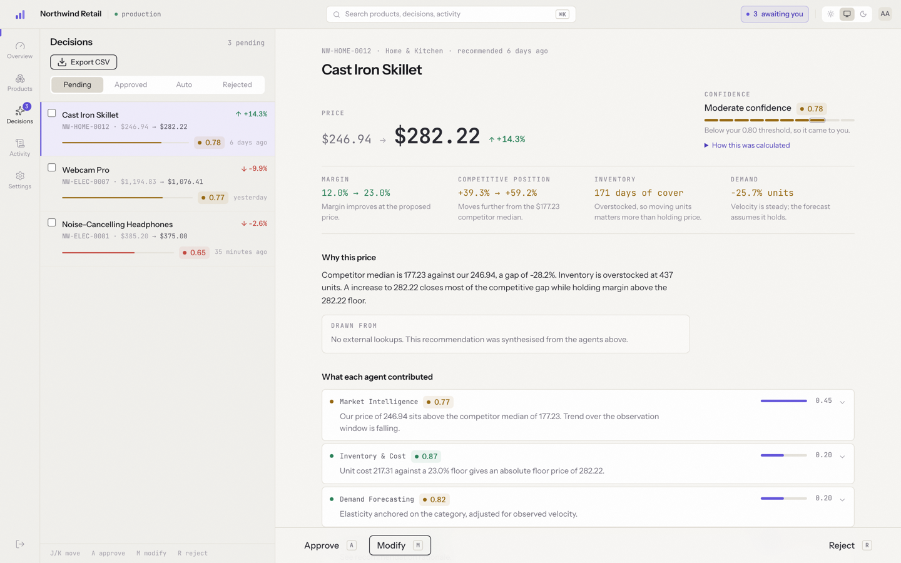

Price and confidence first, because that is the decision. Then what changes if
you take it, then what each agent contributed with its factor weight, then the
tool calls underneath. Approve, modify or reject, with the modify path checked
against the same margin floor the AI was.

### Agent pipeline, mid-run

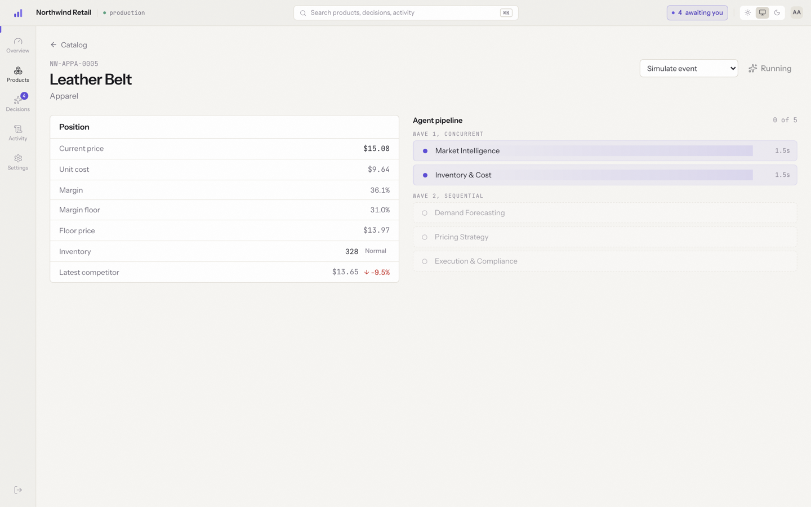

Streamed over SSE as it happens, three of five agents done. Wave 1 runs Market
Intelligence and Inventory & Cost concurrently; wave 2 is sequential because
each step needs the one before it.

### Agent pipeline, complete

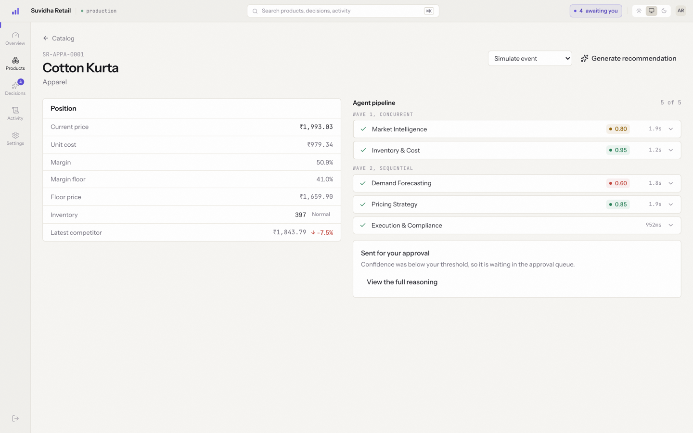

Per-agent confidence and duration, then the threshold branch: this run landed
below the configured confidence threshold, so it was routed to a human instead
of executing. Above the threshold it would have auto-executed and said so.

### Audit trail

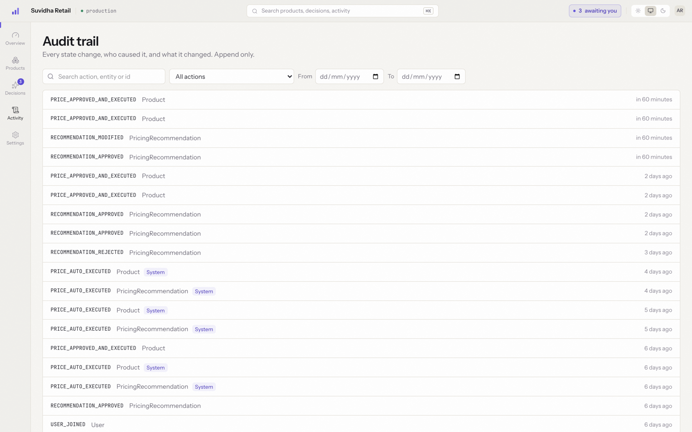

Append only. Every state change with its actor, before and after values, and
timestamp. A null actor is the system, which is how an auto-executed price
change is distinguished from a human approval. Filterable and searchable.

### Settings

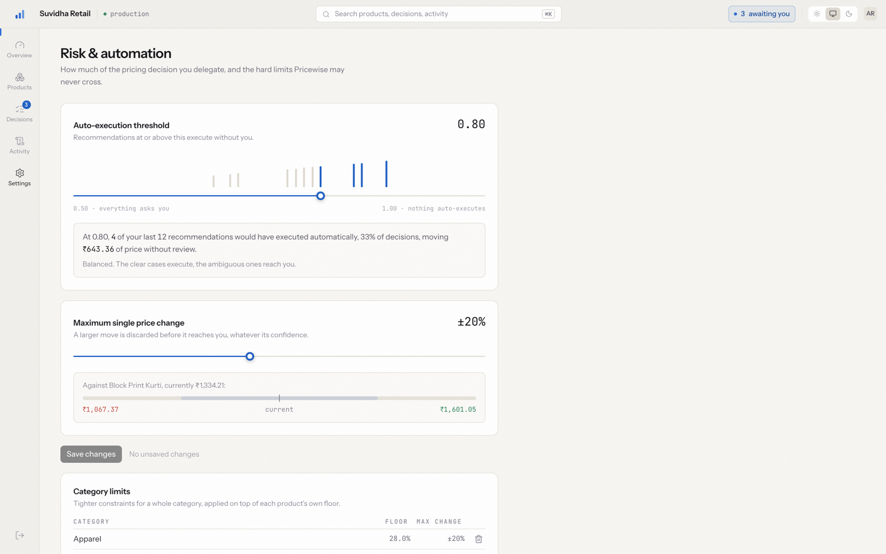

Admin only, and enforced by the API independently of this screen. The
confidence threshold shows its consequence against the last 50 runs rather than
asking an admin to guess what 0.80 means.

---
## Known limitations

Stated rather than hidden.

- **Not deployed yet.** Manifests for Render and Vercel are in the repo and the
  code is ready for a split-origin deploy; the accounts are not linked.
- **Competitor and demand data are synthetic**, generated by
  `apps/backend/src/scripts/`. The tool interface is the real shape, so
  swapping in a live feed would not change the agents.
- **The e-commerce platform is a mock**, exposed as a real HTTP route so it is
  visibly an external system that can fail, with configurable failure and
  rollback.
- **Confidence is corrected, not calibrated.** The threshold was moved from
  0.85 to 0.80 on 13 measured runs because the original figure auto-executed
  23% against a 40-60% target. That fixes an obviously mis-set constant; it does
  not establish that the score predicts whether a human agrees. That needs human
  decisions to compare against. See DECISIONS.md §6.
- **`--t5` in the design palette is below WCAG AA** at 2.68:1, and the handoff
  uses it for the keyboard-hint strip. Recorded as a bounded exemption in the
  contrast test rather than passed over silently.
- **The Playwright suite needs a running stack.** It drives a real browser
  against a seeded database, so `docker compose up` (or the Bun path plus
  `db:seed`) has to be up first. It is not part of `bun run test` for that
  reason.
- **Mobile is supported but not the target.** Every route was checked for
  horizontal overflow at 375, 640, 768, 1024 and 1280, and the shell reflows to
  a bottom tab bar below 768. It is a dense data tool built for a desktop
  analyst; the catalogue drops columns on a phone rather than pretending a
  nine-column table fits.
- **Cut deliberately:** Postgres RLS as a defence-in-depth backstop, bulk
  approve, and URL-synced filter state.

---

## Layout

```
apps/backend     Express API, Prisma, the five agents
apps/frontend    React app
packages/shared  Zod schemas imported by both, so rules cannot drift
docs/            PRD, implementation plan, API contract, diagrams, spike notes
```

The backend follows `route → controller → service → repository`, one direction
only. Prisma may only be imported inside `repositories/`, and `process.env` may
only be read in `lib/env.ts`. **Both are enforced by lint rules rather than by
review**, which is what makes "every query is tenant-scoped" a checkable claim
rather than an assertion. It caught a real violation during the build.
